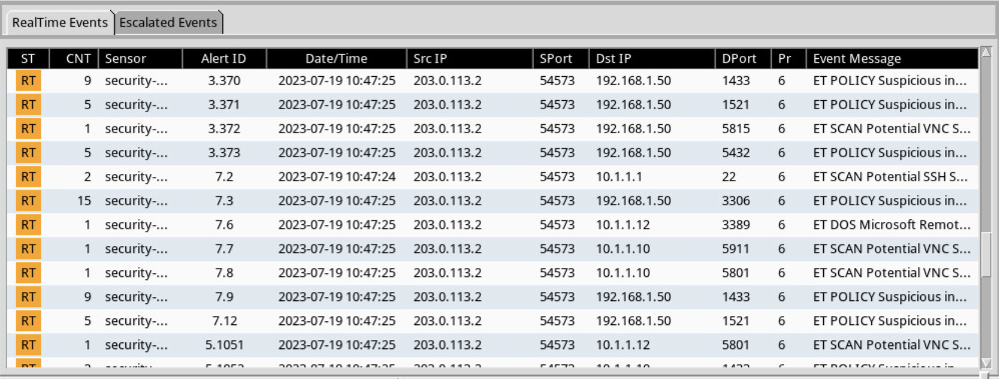

<h1>Identifying & Analyzing Network/Host Intrusion Detection System
(NIDS/HIDS) Alerts</h1>

<h2>1. Use Zenmap to Scan Network Targets</h2>

In this task, you will use the integrated zenmap tool in Kali to create
traffic data that can be later analyzed.

>1\. Launch the SecOnion virtual machine.
>
> 2\. On the login screen, type soadmin as the username and mypassword
> as the password. Click Log In.
>
>  alt="A screenshot of a computer login Description automatically generated" />
>
> 3\. Once logged in, click the start button, followed by clicking on
> Terminal Emulator to launch a new terminal.
>
> 4\. Type the command below, followed by pressing the Enter key. If
> prompted, enter mypassword for root privileges.
>
>soadmin@Security-Onion:~\$ sudo service nsm status
>
>5\. Launch the Kali virtual machine to access the graphical login
screen.
>
> 6\. Log in as root with toor as the password. Open the Kali PC Viewer.
>
> 7\. Click on the Applications Menu option located on the top menu pane
> and navigate to Kali Linux \> Information Gathering \> Network
> Scanners \> zenmap.
>
>  alt="A screenshot of a computer Description automatically generated" />
>
> 8\. A new Zenmap window will appear. Type 203.0.113.1 192.168.1.0/24
> 10.1.1.0/28 into the Target whitespace.
>
> 9\. Modify the Command section so that it is written like so. Click
> the Scan button.
>
> 10\. Once the scan finishes, examine the output and take notice of
> which common ports are opened on which
> system.
>
<h2>2. Network Security Monitoring with Sguil</h2>

> 2.1. Running Sguil

> 1\. Change focus to the SecOnion system.

> 2\. Double-click the sguil desktop icon to launch the application.
>
>  alt="A logo of a fruit Description automatically generated" />
>
> 3\. A new window will appear. Type soadmin for the username and
> mypassword as the password. Leave the remaining fields at default
> values. Click Ok to log in.
>
>  alt="A computer screen shot of a login Description automatically generated" />
>
> 4\. Check all checkboxes by clicking on the Select All button,
> followed by clicking on Start
> SGUIL. alt="A screenshot of a computer Description automatically generated" />
>
> 5\. Notice upon login, the RealTime Events tab is already populated
> with events as Sguil is actively running in the background.
>
>  alt="A screenshot of a computer Description automatically generated" />
>
> 6\. Change focus to the Kali system.
>
> 7\. Focus on the Zenmap application. If Zenmap is not already open,
> open a new terminal and type zenmap followed by pressing Enter to
> launch the application.
>
> 8\. Within the Zenmap window, type 10.1.1.10 as the Target.
>
>  alt="A white rectangular object with black numbers Description automatically generated" />
>
> 9\. Select Intense scan as the Profile.
>
>  style="width:3.69444in;height:0.38889in" />
>
> 10\. Verify that the command being used is set to nmap -T4 -A -v
> 10.1.1.10. Click Scan.
>
>  style="width:7.55556in;height:0.88889in" />
>
> 11\. Once the scan finishes, change focus back to the SecOnion system.
>
> <h2> 2.2. Analyzing Network Events using Sguil</h2>
>
> 1\. While viewing the Sguil monitoring application, organize the
> events by date. Click on the Date/Time column header, making sure that
> the latest events show up in a descending order.
>
>  alt="A screenshot of a computer Description automatically generated" />
>
> 2\. Notice the event under Event Message, noting that an ET SCAN NMAP
> OS Detection has been detected. Select the
> event. style="width:11.27778in;height:0.38889in" />
>
> 3\. In the bottom-right pane, check the box for Show Packet Data and
> Show Rule.
>
> 4\. 4. Analyze the packet data.
>
>  alt="A screenshot of a computer Description automatically generated" />
>
> 5\. Export a detailed report for this specific event to present to
> management. While having the event selected (highlighted), click on
> the Reports menu option located on the top menu pane and select Export
> Events to a Text File (Detail) \> Normal.
>
>  alt="A screenshot of a computer Description automatically generated" />
>
> 6\. In the Select a Text Report Type window, click OK to continue.
>
>  alt="A screenshot of a computer Description automatically generated" />
>
> 7\. In the Save As window, verify the directory is set to
> /home/soadmin. Type report1 as the filename and click Save.
>
>  style="width:4.91667in;height:3.26389in" />
>
> 8\. Click OK to confirm the file has been saved.
>
> 9\. While on the SecOnion system, open a terminal and type the command
> below to view the contents of the report.
>
> soadmin@Security-Onion:~\$ cat /home/soadmin/report1
>
>  alt="A screenshot of a computer Description automatically generated" />
>
> 10\. After viewing the report in the terminal, close the terminal
> window.
>
> 11\. Close the Sguil application.
>
> 12\. Leave the SecOnion viewer open to continue with the next task.

<h2> 3. Network Security Monitoring with Squert</h2>

> 3.1\. Analyzing Security Monitoring using Squert

> 1\. While on the SecOnion system, double-click on the Squert desktop
> icon.
>
>  alt="A computer screen shot of a globe Description automatically generated" />
>
> 2\. A Firefox web browser should appear. Verify the address field is
> populated with the following: https://localhost/squert. Click on
> Advanced followed by clicking the Proceed to localhost link.waq
>
>  style="width:6.49117in;height:4.05941in" />
>
>  alt="A close-up of a computer screen Description automatically generated" />
>
>  alt="A screenshot of a login box Description automatically generated" />
